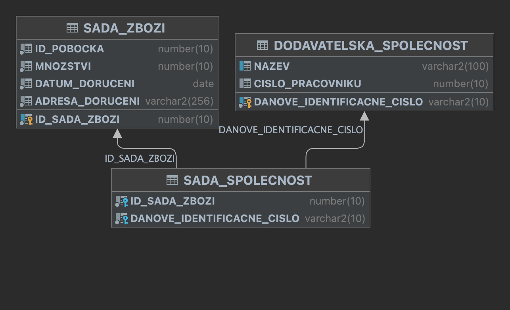

# Oracle PL/SQL – Data Generation Procedures

Brief overview of the task.

---

## Assignment
1. **Table Selection**  
   - Choose two main tables and one junction (relationship) table in your schema.  
2. **Procedures**  
   - For each table, create a PL/SQL procedure with a parameter `p_count NUMBER` specifying how many rows to insert.  
   - Generate pseudorandom data using the `DBMS_RANDOM` package.  
     - You may define sequences (e.g., names, categories) and combine them randomly.  

---

## Testing
- Provide **log files** (or screenshots from DataGrip) demonstrating:  
  1. Calling each procedure with example parameters  
  2. Successful execution  
  3. Evidence of data insertion (e.g., `SELECT COUNT(*) FROM ...`)  
- Organize logs clearly so that the functionality can be verified at a glance without deep code inspection.

---

## Solution Overview
- **Database Schema:**  
    
- **Selected Tables & Procedures:**  
  - `sada_zbozi` → `fill_sada_zbozi(p_count NUMBER)`  
  - `dodavatelska_spolecnost` → `fill_dodavatelska_spolecnost(p_count NUMBER)`  
  - `sada_spolecnost` (junction) → `fill_sada_spolecnost(p_count NUMBER)`

---

## Deliverables
- `create.sql` – script to create schema and tables  
- `procedure-1.sql` – `fill_sada_zbozi`  
- `procedure-2.sql` – `fill_dodavatelska_spolecnost`  
- `procedure-3.sql` – `fill_sada_spolecnost`  
- `.png` –  files showing procedure calls and outputs  
