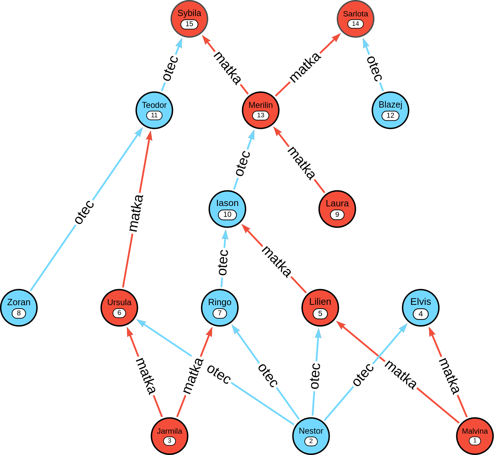

# Recursive Queries & Parameterized Cursor

This directory contains the lab assignment for implementing recursive ancestor queries in Oracle PL/SQL, wrapping them into a parameterized cursor procedure.

---

## Objectives
- Explore recursive SQL querying on self‑referential data  
- Package the result into a PL/SQL procedure that returns a parameterized cursor  
- Test both positive and edge‑case inputs

---

## Assignment

1. **Input Data**  
   - Use the provided `vydry.sql` to load the `vydry` table, where `matka` and `otec` are self‑referencing foreign keys to `vydry.id`.

2. **Recursive Query**  
   - **Iteration 1:** Write a recursive query for **one** lineage (male *or* female).  
     - E.g. female line for Merilin: `Laura`; male line: `Iason, Ringo, Nestor`.  
   - **Iteration 2:** Extend to **both** lineages, annotate each ancestor with a generation number (and format output for readability).  
     - E.g. `Merilin: Iason(1), Laura(1), Ringo(2), Lilien(2), …`

3. **Parameterized Cursor Procedure**  
   - Create `get_ancestors(p_name VARCHAR2, p_lineage VARCHAR2)` that:  
     - Validates `p_name` exists and `p_lineage` ∈ {‘male’, ‘female’, ‘both’}.  
     - Opens a cursor over the appropriate recursive query.  
     - Returns ancestor names (and generation numbers, if both).

---

## Deliverables

- `dotazy.sql` — three standalone queries (Iteration 2) for:
  - ID 10, male  
  - ID 10, female  
  - ID 10, both  
- `dotazy.log` — results of the above queries  
- `procedura.sql` — the `get_ancestors` procedure with parameterized cursor  
- `test-procedura.sql` — calls to `get_ancestors` for:
  - `(Iason, 'male')`  
  - `(Iason, 'female')`  
  - `(Iason, 'both')`  
  - `(Zoran, 'both')`  
  - `(Celestyn, 'both')`  
- `test-procedura.log` — output of each test call  

---

## Family Tree Diagram

